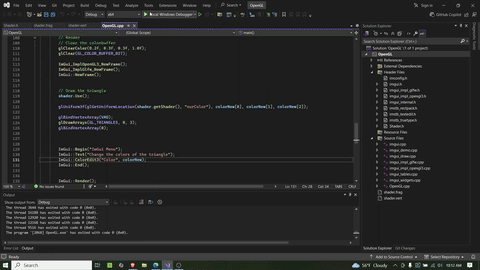

# sandbox_v3
Back to learning OpenGL. More triangles but now with ImGui. 

<pre>
 ▒█████   ██▓███  ▓█████  ███▄    █   ▄████  ██▓
▒██▒  ██▒▓██░  ██▒▓█   ▀  ██ ▀█   █  ██▒ ▀█▒▓██▒
▒██░  ██▒▓██░ ██▓▒▒███   ▓██  ▀█ ██▒▒██░▄▄▄░▒██░
▒██   ██░▒██▄█▓▒ ▒▒▓█  ▄ ▓██▒  ▐▌██▒░▓█  ██▓▒██░
░ ████▓▒░▒██▒ ░  ░░▒████▒▒██░   ▓██░░▒▓███▀▒░██████▒
░ ▒░▒░▒░ ▒▓▒░ ░  ░░░ ▒░ ░░ ▒░   ▒ ▒  ░▒   ▒ ░ ▒░▓  ░
  ░ ▒ ▒░ ░▒ ░      ░ ░  ░░ ░░   ░ ▒░  ░   ░ ░ ░ ▒  ░
░ ░ ░ ▒  ░░          ░      ░   ░ ░ ░ ░   ░   ░ ░
	░ ░              ░  ░         ░       ░     ░  ░</pre>
